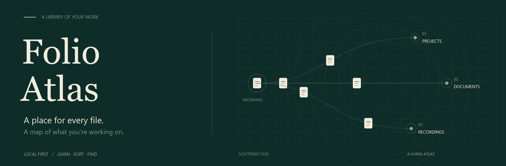

<p align="center"></p>

<p align="center">
  <a href="https://github.com/gavishap/folio-atlas/actions/workflows/test.yml"></a>
  
  <a href="LICENSE"></a>
  
</p>

<h1 align="center">Folio Atlas</h1>
<p align="center"><strong>A place for every file. A map of what you’re working on.</strong></p>

Downloads accumulate. A contract belongs to a project, a spreadsheet belongs to a client, a recording belongs to a conversation. Folio Atlas helps your local agent learn those relationships from **your own project folders**, then build a library you can browse by project, subject, date, or size.

Three agent skills. One standard-library Python engine. No shipped project profiles, account credentials, personal files, or background cleanup.

| Say this to your agent | What happens |
| --- | --- |
| **“Use Folio Sort to organize my Downloads using these projects.”** | Learn your project vocabulary → inspect a preview → move within Downloads → verify → build your browser. |
| **“Use Folio Refresh to sort my new downloads.”** | Reuse your saved schema and sort new loose items. Your existing library stays in place. |
| **“Use Folio Archive to back this up to Google Drive.”** | Build a portable ZIP → upload with your available tools → download it again → hash and restore every file. Local deletion is a separate, explicit request. |

## Start in two minutes

You need **Python 3.10+** and an agent with local filesystem and shell access, such as Codex desktop/CLI or another local coding agent. A web chat without a local executor cannot move files on your computer. Sorting needs no API key, cloud account, or Python dependencies.

```sh
git clone https://github.com/gavishap/folio-atlas.git
cd folio-atlas
python scripts/folio.py --help
```

Open this repository in your agent. Give it this prompt, replacing the paths with yours:

> Read AGENTS.md and use the Folio Sort skill. My target is `<my Downloads folder>`. My project folders are `<project one>` and `<project two>`. Learn from those projects, inspect your preview, then organize my Downloads without deleting anything. Keep existing folders together and show me START HERE afterward.

The repository instructions route the agent to the bundled skills. You can also install it as a plugin through a supported local marketplace; see [installation options](docs/GETTING-STARTED.md). **Clone the whole repository**: the three skills share one Python engine.

Prefer to try it on fictional files first?

```sh
python tools/create_demo.py --out ../folio-atlas-demo --organize
```

Open the generated `Inbox/START HERE - Folio Atlas.html`. This creates only a new, synthetic demonstration folder. [Make your demo video →](docs/DEMO.md)

## It learns your work

Folio samples project filenames, learns vocabulary that distinguishes projects from one another, and compares a bounded set of exact document fingerprints. Optional document reading adds bounded local text evidence. Your agent reviews the evidence and can add aliases or subject rules supported by your files.

Strong matches enter a project. Uncertain matches enter a sensible type and subject folder. A generic word like “invoice” does not identify a project. Classification is conservative and can still need correction; the preview includes the reason for each destination.

```text
Downloads/
├── START HERE - Folio Atlas.html
├── Folio Library/
│   ├── Projects/
│   │   ├── Juniper Studio/          ← fictional example
│   │   │   ├── PDFs/Contracts/
│   │   │   └── Images/
│   │   └── Harbor Ledger/
│   │       └── Excels/
│   └── By Type/
│       ├── PDFs/Resumes/
│       ├── Recordings/WhatsApp Recordings/
│       ├── Documents/
│       └── Preserved Folders/
└── .folio-atlas/                    ← your private schema and journals
```

Existing folders move as intact bundles. Saved web pages stay with their resource folders. Recognizable loose source bundles stay together. Links, junctions, and incomplete downloads are preserved and reported.

## Your folders, with another way to browse

The generated **START HERE** is a standalone HTML file with every regular file, including bundle contents; search/project filters; inclusive date ranges; newest/oldest and largest/smallest sorting; and a folder-bundle view. Modified dates and sizes are recorded; created dates appear when available and survive a verified Folio restore.

Relative links keep working when the complete library moves. Nothing is embedded as a replacement for your original files. Keep the HTML beside the folders. Open it locally after downloading and extracting the backup; Drive’s HTML preview does not provide a live local file browser. The index is a snapshot—ask for Refresh after more downloads or edits.

## Come back tomorrow

> Use `$folio-refresh` to sort the new items outside my existing Folio Library. Reuse the schema, preserve the organized folders, and refresh START HERE.

Refresh does not relearn projects or rearrange your existing library. Ask for a schema update when your work changes. See [the saved schema](docs/SCHEMA.md).

## Backup is an option, never a side effect

`$folio-archive` is explicitly invoked. It uses your existing Google Drive connector/plugin where that tool supports binary upload **and** download; otherwise it uses approved browser controls or a manual transfer. The Python engine itself has no cloud integration or credentials.

Before local cleanup, the workflow requires a distinct download of the cloud object, matching ZIP size and SHA256, a fresh complete restore, every restored file’s SHA256, and valid local index links/date/size records. The agent also checks the cloud object still exists. A local ZIP, an upload message, or a matching length alone is insufficient.

**“Delete temporary backup copies”** removes verified working copies. **“Delete backed-up originals too”** is a separate scope and additional command flag. New, changed, protected, unbacked, or linked content stays. The Downloads root, saved schema, index, and cloud object stay. [Exact workflow and commands →](docs/GOOGLE-DRIVE.md)

## Built to preserve files

Sorting previews first, refuses overwrites and stale plans, journals moves, and verifies file identity, size, and modification time. It supports undo while the originals remain unchanged. Backup and cleanup add full SHA256 checks. Neither is designed to run while another application changes the same files. [Safety details and limits →](docs/SAFETY.md)

The public package contains reusable code, documentation, and synthetic examples. Your generated index, inventories, project profiles, receipts, and archives contain **your** data: keep them private. Local execution does not override your agent provider’s data policies. [Privacy →](PRIVACY.md)

## Inside the package

| Path | Purpose |
| --- | --- |
| `skills/folio-sort/` | Learn, preview, organize, verify, and undo. |
| `skills/folio-refresh/` | Reuse the schema for newly arrived items. |
| `skills/folio-archive/` | Optional cloud backup, verified restore, explicit cleanup. |
| `folio_atlas/` | Shared Python engine and portable HTML browser. |
| `scripts/folio.py` | Run from a clone, with no installation required. |
| `tools/` | Synthetic demo, reproducible animation, privacy-checked release builder. |
| `tests/` | Synthetic preservation, recovery, refresh, backup, and browser-control tests. |

Windows, macOS, and Linux use native no-overwrite moves. See [validation](VALIDATION.md) for what is tested and [CLI reference](docs/COMMANDS.md) for direct use.

MIT licensed. Built by [gavishap](https://github.com/gavishap). Public marketplace publication is separate from GitHub distribution: [maintainer publishing guide](PUBLISHING.md).
